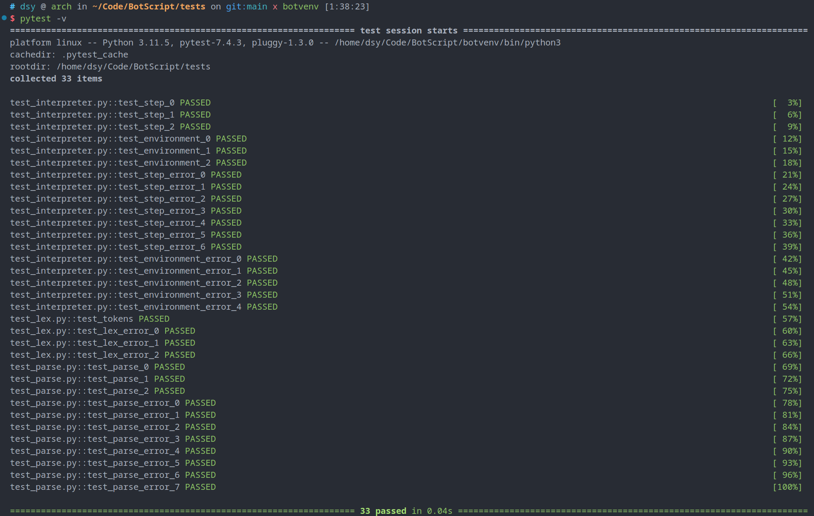

# 验收报告

## 1 风格

### 代码注释

本项目有以下相关注释：

- 类：使用文档字符串进行类的功能说明以及成员方法的功能说明
- 函数：使用文档字符串对函数功能进行说明，有些文档字符串有其他作用的函数使用单行注释在函数前进行功能注释
- 代码段：使用单行注释对部分代码段的功能进行简要说明
- 函数注解：对函数形参与返回值进行类型注解以增强可读性
- 变量注释：对一些有必要的内容进行注释

### 命名

本项目依照 PEP 8 提案（Python 编码风格指南）与 PEP 257 提案（文档字符串约定）进行命名规范，包括以下内容：

- 函数名使用 `lower_case_with_underscores` 样式
- 类名使用大驼峰 `CapitalizedWords` 样式
- 函数或成员方法的文档字符串包括：功能概述、形参含义、返回值含义
- 函数命名使用 `谓语_宾语` 样式
- 变量命名使用 `lower_case_with_underscores` 样式

在使用 `PLY`（Python Lex Yacc）模块进行词法分析与语法分析时，遵循以下命名规范：

- token 以全部大写 `TOKEN` 样式命名
- 正则表达式匹配规则以 `t_func_name` 样式命名
- 语法分析规则以 `p_char_name` 样式命名

### 其他

- 运算符之间的空格增强可读性
- 较长内容的换行书写
- git commit 内容使用插件进行规范化

## 2 设计和实现

### 数据结构

**注意：详细的数据结构说明请见由文档字符串生成的项目文档，更加全面并且可读性更强**

在 `parse.py` 中进行语法分析后产生的语法树数据结构说明如下：

#### 语法树

语法树数据结构的直观描述如下：

```python
[
    ("step0", [
        ("speak", ["string0", "string1", ...]),
        ("listen", start, end),
        ("branch", {
            "answer0": "step1",
            "answer1": "step2",
            ...
        }),
        ("silence", "step3"),
        ("default", "step4")
    ]),
    ("step1", [
        ("speak", ["$var0", "string2", ...]),
        ("exit",)
    ]),
    ...
]
```

详细说明：

- 语法分析返回的结果是一个 Python 列表，其中的元素为每一个步骤 step
- 每一个步骤 step 是一个 Python 元组
  - 元组的一个元素 first 为该步骤的 ID ，为一个字符串
  - 元组的第二个元素 second 为该步骤包含的所有动作 actions
- 步骤中包含的所有动作 actions 为一个 Python 列表，其中的每一个元素都是 speak, listen, branch, silence, default, exit 之一
- 每一个动作都是一个 Python 元组
  - 元组第一个元素是一个字符串，指示该动作，为 speak, listen, branch, silence, default, exit 之一
  - 元组第二个元素是该动作相关的信息，详细内容如下
    - speak ：一个 Python 列表，元素均为字符串，可能有字符串字面量也有变量
    - listen ：一个 Python 二元组，第一个元素为一个整数表示开始时间，第二个元素为一个整数表示结束时间
    - branch ：一个 Python 字典，key 为语言识别中包含的字符串，value 为下一个步骤的 step ID
    - silence ：一个字符串，沉默动作的 step ID
    - default ：一个字符串，默认动作的 step ID
    - exit ：空，标识这个步骤后退出

在 `interpreter.py` 中进行语义分析后构建的运行环境数据结构说明如下：

#### Environment 类

执行环境 `Environment` 类的数据结构直观描述如下：

```python
self.var_table = {
    "$name": "someone's name",
    "$balance": number,
    ...
}

self.step_table = {
    "welcome": <Step object>,
    "step0": <Step object>,
    "step1": <Step object>,
    ...
}

self.step = self.step_table["welcome"]
```

详细描述：

- 字符串输入输出使用到的变量表 `var_table` ，用于存储系统中使用到的变量信息，由用户相关信息管理系统实现，本项目不予实现
- 步骤 ID 与步骤内动作的映射表，为一个 Python 字典，key 为步骤 ID，value 为步骤类 Step 的实例
- `self.step`  存储当前正在执行的步骤，如果退出则当前步骤置为 `None` ；初始化为步骤 `welome`

成员方法包含以下内容，详见项目文档：

- `make_step_table` 生成 Step 表
- `check_semantic` 检查脚本语义是否正确并给出错误信息
- `speak` 机器人说话方法，用于给主程序调用
- `listen` 机器人获取用户输入，用于给主程序调用

#### Step 类

步骤 Step 类的数据结构直观描述如下：

```python
self.id = "step0"
self.speak = ["$name", "你好", ...]
self.listen = (5, 20)
self.answer = {
    "投诉": "complainProc",
    "账户": "accountProc",
    ...
}
self.silence = "silenceProc"
self.default = "defaultProc"
self.exit = False
```

详细描述：

- `id` 此 Step 的步骤 ID
- `speak` 说话的字符串列表，包含变量
- `listen` 起止时间元组
- `answer` 分支动作 Python 字典，key 为用户回复内容中包含的字符串，value 为跳转的步骤 ID
- `silence` 沉默动作的步骤 ID
- `default` 默认动作的步骤 ID
- `exit` 该步骤是否退出

成员方法包含以下内容，详见项目文档：

- `set_step` 根据语法树中的 step 元组的第二个列表提供的步骤内动作列表，设置 Step 类的成员变量
- `check_step` 对 step 的成员变量进行语义检查，并提示错误信息

### 模块划分

**注意：详细内容见由文档字符串生成的项目文档**

本项目模块分为以下部分：

- `lex.py` 对脚本进行词法分析
- `parse.py` 对脚本进行语法分析并返回语法树数据结构
- `interpreter.py` 使用语法树构建用于执行的运行环境数据结构，并进行语义正确性检查
- `main.py` 纯命令行界面交互方式的机器人

### 功能

#### 基础功能

本项目完成了在课题描述中要求的以下基础功能：

- 自由定义内容的脚本语言 BotScript
- 纯命令行界面交互方式
- 根据脚本生成不同机器人

#### 拓展功能

除了基础功能，本项目还实现了以下拓展功能：

- 词法分析检查
- 语法分析检查
- 语义分析检查并指出错误类型
- ~~使用 nicegui 库对脚本生成的机器人对话过程实现图形化操作~~

### 文档

#### 用户使用手册

即本项目 `README.md`

#### 自动生成项目API文档

使用 Sphinx 模块和 `sphinx-autoapi` 插件根据文档字符串自动生成项目文档 `doc/build/index.html`

#### 测试文档

即本文档第 4 节“测试”的内容

#### 语言记法文档

即本文档第 5 节“记法”的内容

#### 验收报告

即本文档所有内容

## 3 接口

### 程序间接口

本项目主要分为四个模块：

- 词法分析获取 token
- 语法分析构建语法树
- 语义分析并根据语法树创建执行环境
- 主程序与用户接口

#### 词法分析接口

使用 PLY（Python Lex Yacc）模块中的 lex 进行词法分析，导入模块：

```python
import ply.lex as lex
```

标记名称 Python 列表共享数据，向词法分析器说明有哪些需要识别的标记：

```python
# token 列表
tokens = [
    'ID',
    'VAR',
    'STRING',
    'NUMBER',
    'COMMENT',
]
```

字面量 Python 列表共享数据，向词法分析器说明有哪些字符作为字面量处理：

```python
# 字面量
literals = ['+', ',', ':', ';']
```

保留字 Python 字典共享数据，键为识别出来的字符串，值为保留字 token 名称

定义完之后还需要将其值部分加入到 token 列表中：

```python
# 保留字
reversed = {
    'step': 'STEP',
    'speak': 'SPEAK',
    'listen': 'LISTEN',
    'branch': 'BRANCH',
    'silence': 'SILENCE',
    'default': 'DEFAULT',
    'exit': 'EXIT',
}

tokens = tokens + list(reversed.values())
```

标记的规则函数

每种标记用一个正则表达式规则来表示，每个规则需要以"`t_`"开头声明，表示该声明是对标记的规则定义。紧跟在 `t_` 后面的单词，必须跟标记列表中的某个标记名称对应。如果需要执行动作的话，规则可以写成一个方法。例如，下面的规则匹配数字字串，并且将匹配的字符串转化成 Python 的整型：

```python
# 正则表达式规则
def t_ID(t):
    r'[a-zA-Z_][a-zA-Z_0-9]*'
    t.type = reversed.get(t.value, 'ID')
    return t

def t_VAR(t):
    r'\$[a-zA-Z_][a-zA-Z_0-9]*'
    return t

def t_STRING(t):
    r'\".*?\"'
    return t

def t_NUMBER(t):
    r'\d+'
    t.value = int(t.value)
    return t

def t_COMMENT(t):
    r'\#.*'
    pass

# 丢弃空行
def t_newline(t):
    r'\n+'
    t.lexer.lineno += len(t.value)

# 忽略的字符，包括空格和制表符
t_ignore  = ' \t'

# 错误处理
def t_error(t):
    print(f"LexError: lineno {t.lineno} lexpos {t.lexpos}: {t.value[0]}")
    exit(1)
```

lexer 接口

函数`lex.lex()`使用 Python 的反射机制读取调用上下文中的正则表达式，来创建 lexer。lexer 一旦创建好，有两个方法可以用来控制 lexer 对象：

- `lexer.input(data)` 重置 lexer 和输入字串
- `lexer.token()` 返回下一个 LexToken 类型的标记实例，如果进行到输入字串的尾部时将返回`None`

```python
# 构建词法分析器
lexer = lex.lex()
```

#### 语法分析接口

PLY（Python Lex Yacc）模块中的 yacc 进行语法分析，导入模块：

```python
import ply.yacc as yacc
```

同时需要从之前的词法分析模块中获取 token 列表以及词法分析器，下面导入完成这些工作：

```python
from lex import tokens
```

构建语法分析器需要使用语法规则定义的函数接口：

```python
# 语法分析规则
def p_script(p):
    '''script : step
              | step script'''
    if len(p) == 2:
        p[0] = [p[1]]
    else:
        p[0] = [p[1]] + p[2]

def p_step(p):
    '''step : STEP ID ':' actions'''
    p[0] = (p[2], p[4])

def p_actions(p):
    '''actions : action ';'
               | action ';' actions'''
    if len(p) == 3:
        p[0] = [p[1]]
    else:
        p[0] = [p[1]] + p[3]

def p_action(p):
    '''action : speak
              | listen
              | branch
              | silence
              | default
              | exit'''
    p[0] = p[1]

def p_speak(p):
    '''speak : SPEAK string'''
    p[0] = ('speak', p[2])

def p_string(p):
    '''string : STRING
              | STRING '+' string
              | VAR '+' string'''
    if len(p) == 2:
        p[0] = [p[1][1:-1]]
    elif p[1][0] == '$':
        p[0] = [p[1]] + p[3]
    else:
        p[0] = [p[1][1:-1]] + p[3] # 去掉引号

def p_listen(p):
    '''listen : LISTEN NUMBER ',' NUMBER'''
    p[0] = ('listen', (int(p[2]), int(p[4])))

def p_branch(p):
    '''branch : BRANCH STRING ',' ID'''
    p[0] = ('branch', {p[2][1:-1]: p[4]}) # 去掉引号

def p_silence(p):
    '''silence : SILENCE ID'''
    p[0] = ('silence', p[2])

def p_default(p):
    '''default : DEFAULT ID'''
    p[0] = ('default', p[2])

def p_exit(p):
    '''exit : EXIT'''
    p[0] = ('exit', True)

# 错误处理
def p_error(p):
    print(f"SyntaxError: lineno {p.lineno} lexpos {p.lexpos}")
    exit(0)
```

每个语法规则被定义成一个 Python 的方法，方法的文档字符串描述了相应的上下文无关文法，方法的语句实现了对应规则的语义行为。每个方法接受一个单独的 p 参数，p 是一个包含有当前匹配语法的符号的序列，语法产生式从左往右由 0 开始编号获取对应的 token 内容。

最后根据上述接口 PLY 模块可以构建语法分析器，我们保存在 `parser` 变量中供之后解释器使用：

```python
# 构建语法分析器
parser = yacc.yacc()
```

#### 解释器接口

解释器通过调用语法分析器提供的语法分析接口，将语法分析生成的语法树内容通过遍历提取出来，并构建出运行环境所需要的数据结构：

```python
from parse import parser
```

这里还有一个小细节，需要导入 readline 模块才能让 Python 命令行读入中文正常，否则会出现问题：

```python
import readline
```

其余内容为 Environment 类和 Step 类中的成员方法作为给机器人调用的接口，已经在数据结构里介绍过了，详见项目文档。

### 人机接口

将项目克隆到本地，项目根目录下有以下人机接口相关内容：

- 一个名为 `bs` 的 bash 脚本，用以作为人机接口进行操作
- 一个名为 `requirements.txt` 的配置文件，用以脚本中自动安装 Python 模块

第一次启动时目录下没有项目所需的虚拟环境与 Python 模块，启动 `./bs` 程序入口有以下信息：

```zsh
# dsy @ arch in ~/Code/BotScript on git:main x botvenv [16:51:22]
$ ./bs         
Virtual environment not found, create one? [Y/n]

```

可以选择输入 y 自动根据项目根目录下的 `requirements.txt` 文件创建 Python 虚拟环境并自动安装好项目所有依赖的 Python 包：

```zsh
# dsy @ arch in ~/Code/BotScript on git:main x botvenv [16:51:22]
$ ./bs         
Virtual environment not found, create one? [Y/n]
y
Creating virtual environment...
Collecting iniconfig==2.0.0 (from -r ./requirements.txt (line 1))

...

Installing collected packages: ply, pluggy, packaging, iniconfig, pytest
Successfully installed iniconfig-2.0.0 packaging-23.2 pluggy-1.3.0 ply-3.11 pytest-7.4.3
```

然后自动运行我们的解释器 `bs` ，没有输入任何参数给出以下提示：

```zsh
Usage: ./bs <script_file>
```

解释器使用方法为 `./bs <script_file>` ，即执行解释器并以我们编写好的 BotScript 脚本作为参数传入程序。

如果第一次启动时选择不安装虚拟环境，提示请先创建虚拟环境：

```zsh
# dsy @ arch in ~/Code/BotScript on git:main x botvenv [16:52:38] 
$ ./bs
Virtual environment not found, create one? [Y/n]
n
WARNING: Please create a virtual environment first!
```

如果根目录下缺少 `requirements.txt` 配置文件，不会创建任何内容并报错：

```zsh
# dsy @ arch in ~/Code/BotScript on git:main x botvenv [16:56:18] 
$ ./bs
Virtual environment not found, create one? [Y/n]
y
Creating virtual environment...
ERROR: requirements.txt not found!
```

## 4 测试

本项目使用 `pytest` 进行测试，具有自动测试的功能

### 测试桩

#### 词法分析功能测试

对词法分析模块 `lex.py` 的测试模块为 `test_lex.py` ，其中的测试函数如下：

##### 对所有标记的识别

- 测试函数 `test_tokens` ：验证词法分析器能够识别所有规定的标识

##### 对非法标记的错误处理

- 测试函数 `test_lex_error_0` ：非法字符错误提示

- 测试函数 `test_lex_error_1` ：非法字符错误提示

- 测试函数 `test_lex_error_2` ：非法字符错误提示

#### 语法分析功能测试

对语法分析模块 `parse.py` 的测试模块为 `test_parse.py` ，其中的测试函数如下：

##### 对生成的语法树正确性进行检查

- 辅助函数 `check` ：第一个参数为待测试的文件名，第二个参数为答案对象，使用 `assert` 判断生成的语法树与答案是否相等

- 测试函数 `test_parse_0` ：以 `test1.bs` 为测试文件进行测试
- 测试函数 `test_parse_1` ：以 `test2.bs` 为测试文件进行测试
- 测试函数 `test_parse_2` ：以 `test2.bs` 为测试文件进行测试

##### 对语法错误的检查

- 测试函数 `test_parse_error_0` ：步骤定义缺少冒号
- 测试函数 `test_parse_error_1` ：动作定义缺少分号
- 测试函数 `test_parse_error_2` ：动作定义缺少逗号
- 测试函数 `test_parse_error_3` ：speak 语法检查
- 测试函数 `test_parse_error_4` ：listen 语法检查
- 测试函数 `test_parse_error_5` ：branch 语法检查
- 测试函数 `test_parse_error_6` ：silence 语法检查
- 测试函数 `test_parse_error_7` ：default 语法检查

#### 语义分析功能测试

##### 对生成的执行环境与步骤对象的正确性检查

- `steps` 列表，存有测试 Step 类时正确的对象，以供测试 Environment 类时使用

###### 测试 Step 类

- 测试函数 `test_step_0` ：测试 `test1.bs` 中由产生语法树生成的步骤 Step 对象
- 测试函数 `test_step_1` ：测试 `test2.bs` 中由产生语法树生成的步骤 Step 对象
- 测试函数 `test_step_2` ：测试 `test3.bs` 中由产生语法树生成的步骤 Step 对象

###### 测试 Environment 类

- 测试函数 `test_environment_0` ：测试 `test1.bs` 中由产生语法树生成的步骤 Environment 对象
- 测试函数 `test_environment_1` ：测试 `test2.bs` 中由产生语法树生成的步骤 Environment 对象
- 测试函数 `test_environment_2` ：测试 `test3.bs` 中由产生语法树生成的步骤 Environment 对象

##### 对语义错误的检查与错误提示

###### 对单个步骤内的语义检查

- 测试函数 `test_step_error_0` ：测试一个步骤内有多个 speak 动作的错误提示
- 测试函数 `test_step_error_1` ：测试一个步骤内有多个 listen 动作的错误提示
- 测试函数 `test_step_error_2` ：测试一个步骤内有多个 default 动作的错误提示
- 测试函数 `test_step_error_3` ：测试一个步骤内有多个 exit 动作的错误提示
- 测试函数 `test_step_error_4` ：测试一个步骤内缺少 speak 动作的错误提示
- 测试函数 `test_step_error_5` ：测试一个步骤内有 exit 但还有其他动作
- 测试函数 `test_step_error_6` ：测试一个步骤内 listen 起止时间的正确性

###### 对整个脚本的语义检查

- 测试函数 `test_environment_error_0` ：检查 step 的 ID 是否重复，使用 `testbad1.bs` 作为测试文件
- 测试函数 `test_environment_error_1` ：检查是否缺少名为 welcome 的入口步骤，使用 `testbad2.bs` 作为测试文件
- 测试函数 `test_environment_error_2` ：检查是否有不存在的分支，使用 `testbad3.bs` 作为测试文件
- 测试函数 `test_environment_error_3` ：检查是否有不存在的 silence 目标步骤，使用 `testbad4.bs` 作为测试文件
- 测试函数 `test_environment_error_4` ：检查是否有不存在的 default 目标步骤，使用 `testbad5.bs` 作为测试文件

### 自动测试脚本

使用 pytest 自动化模块的单元测试：

```zsh
# dsy @ arch in ~/Code/BotScript/tests on git:main x botvenv [1:31:24] 
$ pytest -v
```

可以看到所有测试结果：




## 5 记法

### 词法规则

**注意：本项目设计的 DSL 语言不区分大小写，解释器会自动忽略大小写**

#### 标识符

`ID`

以字母或下划线开头，由字母、数字或下划线组成

用以命名步骤 Step 名称

#### 保留字

- `step`
- `speak`
- `listen`
- `branch`
- `silence`
- `default`
- `exit`

#### 变量

`VAR`

以 `$` 开头，其后满足标识符规则

在 Speak 、 Listen 中用以作为与字符串连接的内容

#### 字符串字面量

`STRING`

用 `"` 包含的内容

用以作为人机语言交流中的内容

#### 整数数字

`NUMBER`

整型数字

用以标识 Listen 中的起止时间

#### 注释

`COMMENT`

以 `#` 开头，单行注释

#### 字面量符号

`,` 用以分隔 Listen 中的起止时间

`+` 用以字符串与字符串、字符串与变量的连接操作

`:` 跟在 Step 后面表示步骤内容开始定义

`;` 跟在动作末尾表示动作定义结束

### 语法规则

**注意：本项目设计的 DSL 语言不区分大小写，解释器会自动忽略大小写**

#### 定义步骤

使用 `step` 关键字定义步骤，后面跟着的是这个步骤的名字，然后使用 `:` 表示接下来定义步骤内执行的动作：

```bs
step <ID>:
```

例如：

```bs
step welcome:
```

`step` 为定义步骤的关键字，`welcome` 是步骤的名字。

#### 定义动作

定义步骤后紧跟步骤内执行的动作，空白字符会被忽略，换行并缩进是为了增加可读性。

下面例子定义了一个欢迎步骤及其中要执行的动作：

```bs
step welcome:
    speak $name + "您好,请问有什么可以帮您?";
    listen 5, 20;
    branch "投诉", complainProc;
    branch "账单", billProc;
    silence silenceProc;
    default defaultProc;
```

##### 说话动作

使用 `speak` 关键字定义说话动作，后面跟着的是该步骤内机器人要输出的内容，为一个字符串，字符串语法规则稍后叙述：

```bs
speak <string>:
```

例如：

```bs
speak $name + "您好,请问有什么可以帮您?";
```

##### 字符串表达式

字符串表达式由字符串、变量、连接符 `+` 组成，按照二元运算符表达式的规则定义：

```bs
<string> ::= <STRING>
		   | <STRING> + <string>
		   | <VAR> + <string>
```

看以下例子：

- 字符串与字符串连接

```bs
"你好" + "世界"
```

- 字符串与变量连接

```bs
$name + " 你好"
"再见 " + $name
"你好 " + $name + " 很高兴认识你"
```

- 变量与变量连接

```bs
$name + $account
```

相关信息变量的内容由后台读取返回，不在此项目实现范围内。

##### 听话动作

使用 `listen` 关键字定义机器人听话动作，并指定开始与结束的时间：

```bs
listen <NUMBER>, <NUMBER>;
```

例如：

```bs
listen 5, 20;
```

从第 5 秒开始听，到 20 秒结束。

##### 分支动作

使用 `branch` 关键字定义根据客户回答跳转下一步骤的分支，如果客户回答内有相应的部分，跳转到指定的下一步：

```bs
branch <STRING>, <ID>;
```

例如：

```bs
branch "投诉", complainProc;
```

如果客户说的内容中有“投诉”，跳转到 `complainProc` 步骤。

**注意：客户回答的字符串只能是一个字符串字面量而不能是字符串表达式**

##### 沉默动作

使用 `silence` 关键字定义沉默动作，如果客户在 `listen` 中指定的时间内没有识别到说话，跳转到沉默步骤：

```bs
silence <ID>;
```

例如：

```bs
silence silenceProc;
```

如果没有识别到客户说话，跳转到 `silenceProc` 步骤。

##### 默认动作

使用 `default` 关键字定义默认动作，如果客户说的内容不在分支包含的范围内，跳转到默认步骤：

```bs
default <ID>;
```

例如：

```bs
default defaultProc;
```

如果客户说的内容不再分支包含的范围内，跳转到 `defaultProc` 步骤。

##### 退出动作

使用 `exit` 关键字定义退出动作，表示对话结束退出程序：

```bs
exit;
```

此外还有相关的语义规则限制动作定义，见“语义规则”一节叙述。

### 语义规则

**注意：本项目设计的 DSL 语言不区分大小写，解释器会自动忽略大小写**

对本项目的 DSL 语言作如下语义规则限制：

- 脚本中必须含有一个名为 `welcome` 的步骤作为起始步骤
- 每个步骤中必须有且只有一个 `speak` 动作
- 如果一个步骤结束后需要退出，即含有 `exit` ，则不能有除 `speak` 外的其他动作
- 一个步骤里可以没有 `listen` 动作或者只有一个 `listen` 动作
- `listen` 动作的时间必须大于零且起始时间小于等于终止时间
- 如果没有 `listen` 动作，则下一步动作由 `silence` 决定
- 一个步骤里可以没有或有若干个 `branch` 动作
- 一个步骤里可以没有或有且只有一个 `silence` 动作
- 一个步骤里可以没有或有且只有一个 `default` 动作
- 不能出现未定义的步骤
